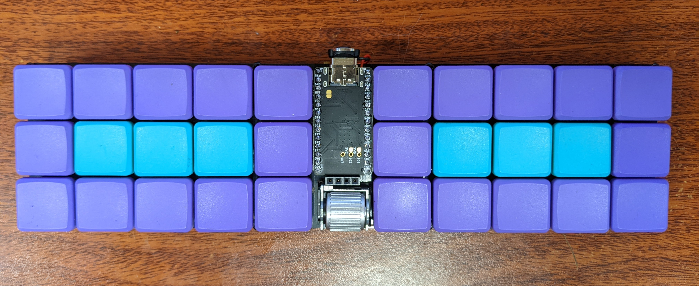
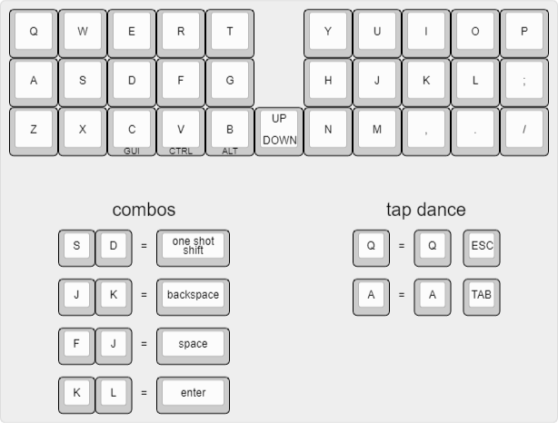

# SatPad

30% ortholinear keyboard built using ergogen. 

 

## Features

- 30 key ortholinear split (10 column, 3 row)
- scroll wheel encoder with click
- OLED display

## Ergogen
built using my customized fork of ergogen that adds a bunch of footprints.

https://github.com/jasonhazel/ergogen/tree/jasonhazel

## Materials
* 1x ProMicro or equivalent
* 1x SSD1306 OLED Screen (optional, QMK Only)
* 30x 1N4148 SOD-123 Diodes
* 30x Kailh Choc v1
* 30x 1u Kailh Choc Keycaps
* 1x EVQWGD001 Encoder
* 1x C128955 Switch (optional)
* 1x LiPo Battery (optional)

## Firmware
QMK: https://github.com/jasonhazel/qmk_firmware/tree/master/keyboards/jasonhazel/satpad

ZMK: https://github.com/jasonhazel/zmk-config/tree/satpad

## Keymap

## Sponsored by PCBWay
This project was initially just to learn, but PCBWay reached out and offered to sponsor further development.  They've been awesome - great quality, fast fabrication and great customer service.  I'll definitely be using them for future projects.
